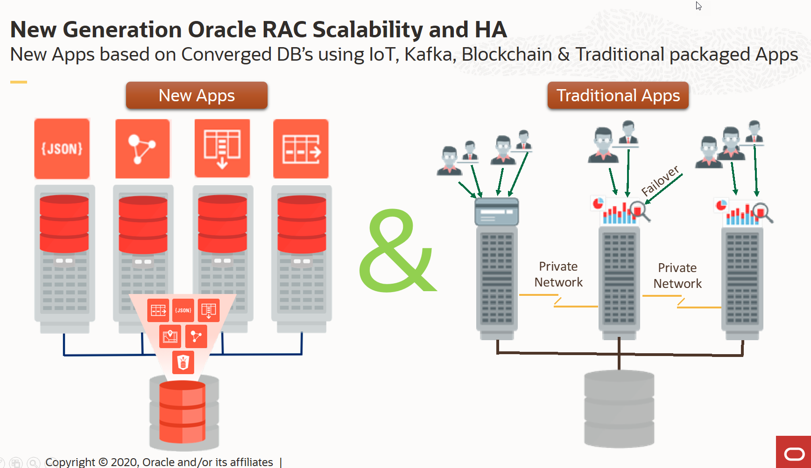

# Introduction

### About this Workshop
Oracle Real Application Clusters can be deployed in a variety of ways. On bare metal servers, in docker containers, on engineered systems and in the Oracle Cloud.

In this workshop you will create a 2-node Oracle Real Application Clusters database in the Oracle Cloud. Oracle Cloud Infrastructure offers 2-node RAC DB systems on virtual machines. When you launch a virtual machine DB system, you choose a shape, which determines the resources allocated to the DB system. After you provision the system, you can change the shape to adapt to new processing capacity requirements.

Once your system is created you will create database services to provide a transparent end-point for your applications to connect to the database and then examine some of the advanced features that services offer.

You will be using the VM.Standard2.2 shape with 4 OCPUs and 60GB of memory.

For more about Virtual DB systems, click [Database Concepts: Overview](https://docs.cloud.oracle.com/en-us/iaas/Content/Database/Concepts/overview.htm).

<if type="odbw">If you would like to watch us do the workshop, click [here](https://youtu.be/bZjnAaJGUfs).</if>

### Workshop Objectives
- Connect to a DB System
- Workload Management with Database Services
- Transparent Application Continuity
- ACCHK

Estimated Workshop Time:  70 minutes

## Introduction to Real Application Clusters ##
Oracle RAC is a cluster database with a shared cache architecture that overcomes the limitations of traditional shared-nothing and shared-disk approaches to provide highly scalable and available database solutions for all business applications. Oracle RAC is a key component of Oracle's cloud architecture.

Oracle Real Application Clusters provides customers with the highest database availability by removing individual database servers as a single point of failure. In a clustered server environment, the database itself is shared across a pool of servers, which means that if any server in the server pool fails, the database continues to run on remaining servers. Oracle RAC not only enables customers to continue processing database workloads in the event of a server failure, it also helps to further reduce costs of downtime by reducing the amount of time databases are offline for planned maintenance operations.

Watch the video below for an overview of Oracle RAC:

## Introduction to Transparent Application Continuity ##
Transparent Application Continuity (TAC) is an operational mode of Application Continuity (AC), a feature available with the Oracle Real Application Clusters (RAC), Oracle RAC One Node and Oracle Active Data Guard options that masks outages from end users and applications by recovering the in-flight database sessions following recoverable outages. TAC performs this recovery beneath the application so that the outage appears to the application as a slightly delayed execution.

TAC improves the user experience for both planned maintenance and unplanned outages. TAC enhances the fault tolerance of systems and applications that use an Oracle database.

Watch the video below for and overview of Application Continuity:

## Workload Management on Oracle RAC

Oracle RAC provides:
* High availability
* Scalability
* Database as a Service

Oracle Database with the Oracle Real Application Clusters (RAC) option allows multiple instances running on different servers to access the same physical database stored on shared storage. The database spans multiple hardware systems and yet appears as a single unified database to the application. This enables the use of commodity hardware to reduce total cost of ownership and to provide a scalable computing environment that supports various application workloads. If additional computing capacity is needed, customers can add additional nodes instead of replacing their existing servers. The only requirement is that servers in the cluster must run the same operating system and the same version of Oracle. They do not have to be the same model or capacity. This saves on capital expenditures allowing customers to buy servers with latest hardware configurations and use it alongside existing servers. This architecture also provides high availability as RAC instances running on different nodes offers protection from a server failure. It is important to note that (almost) all applications such as Oracle Applications, PeopleSoft, Siebel, SAP run without any changes on Oracle RAC.

## RAC and MAA
Oracle MAA is a collection of architecture, configuration, and life cycle best practices and blueprints. It gives Oracle’s customers valuable insights and expert recommendations which have been validated and tested working with enterprise customers. This is also an outcome of ongoing communication, with the community of database architects, software engineers, and database strategists, that helps Oracle develop a deep and complete understanding of various kinds of events that can affect availability or data integrity. Over the years, this led to the development and natural evolution of an array of availability reference architectures.

RAC is a key underpinning of MAA.

## More Information on Oracle RAC

* [Visit the RAC site on OTN](https://www.oracle.com/database/technologies/rac.html)

## More Information on Transparent Application Continuity

* [Visit the AC site on OTN](https://www.oracle.com/goto/ac)

## Acknowledgements

- **Authors/Contributors** - Troy Anthony, Anil Nair, Kay Malcolm
- **Last Updated By/Date** - Troy Anthony, September 2021
